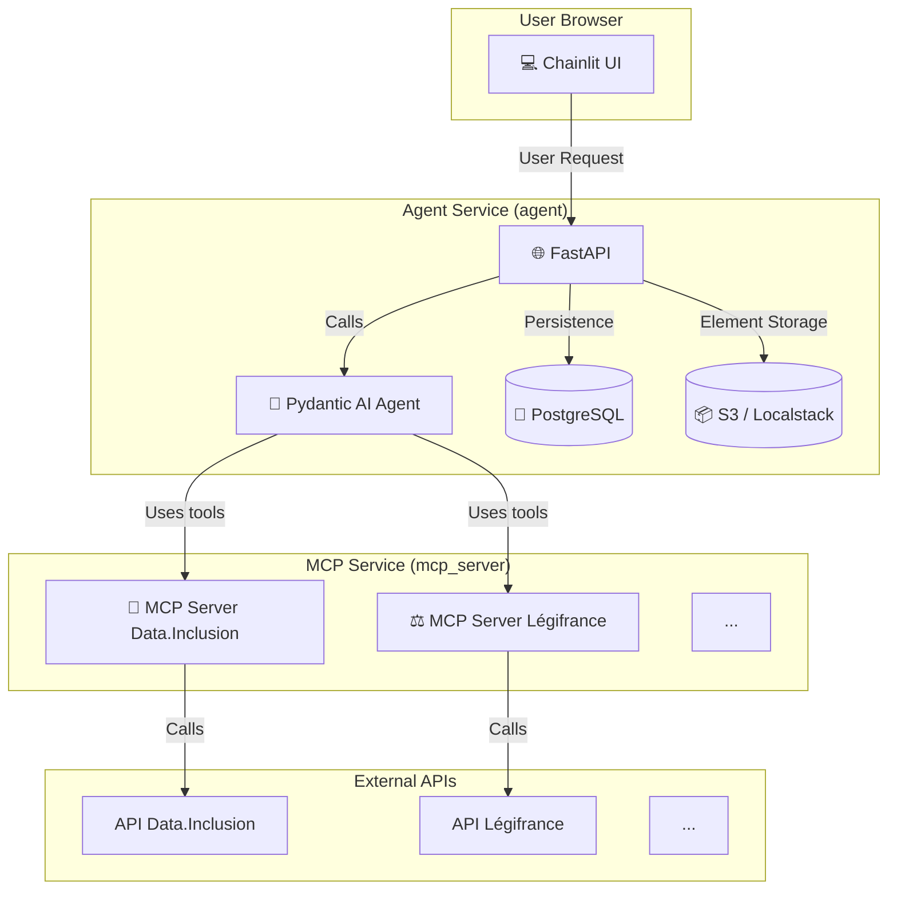

# France-GPT Project Context for Qwen Code

## Project Overview

France-GPT is a conversational AI application, similar to ChatGPT, designed to interact with public French data. It hosts a collection of **specialized AI Agents** that leverage APIs from `data.gouv.fr` (such as Légifrance, Data.Inclusion, INSEE) by transforming them into powerful and reliable tools for Large Language Models (LLMs).

The core need it addresses is the difficulty for AI agents to directly use government APIs due to their complex schemas and raw data formats. France-GPT bridges this gap by converting access to these APIs into **MCP (Model Context Protocol)** tools. MCP standardizes communication between LLMs and external services, making interactions more reliable, secure, and understandable for the AI.

The project serves as a bridge, allowing AI agents to not only consume public data but also understand it, cross-reference it, and create complex workflows to automate tasks and provide precise, contextualized answers.

### Key Features

-   **🤖 Collection of Specialized Agents**: Pre-configured agents like the **Social Agent** (based on Data.Inclusion) and the **Legal Agent** (based on Légifrance), each with its own system prompt and dedicated tools.
-   **🔌 Dynamic MCP Servers**: Uses **FastMCP** to dynamically create MCP servers for each configured government API, making the system extensible to new data sources.
-   **🛠️ Advanced Tool Transformation**: Goes beyond simple OpenAPI endpoint conversion. A `ToolTransformer` enriches generated tools with clearer names, improved descriptions, and optimized schemas for better LLM understanding.
-   **💬 Modern UI with Streaming**: A clean, ChatGPT-like user interface built with **Chainlit**, offering a smooth streaming experience that shows real-time tool calls (`cl.Step`).
-   **🧠 Intelligent Agents with Pydantic AI**: Employs **Pydantic AI** for robust agent creation, conversation history management, and tool orchestration.
-   **📦 Modular and Containerized Architecture**: A clear separation of services (UI, MCP Servers, Database) via Docker, ensuring scalability and ease of deployment.
-   **💾 Data Persistence**: Saves conversations, users, and elements thanks to Chainlit's data layer integration with a PostgreSQL database.

## Architecture

The architecture is modular and robust, clearly separating the responsibilities of each component.



1.  **User Interface (Chainlit)**: The user interacts with one of the specialized agents.
2.  **Agent Service (FastAPI + Pydantic AI)**:
    -   Receives the user's request.
    -   The selected **Pydantic AI Agent** processes the request.
    -   If necessary, the agent decides to use one or more tools. It communicates with the appropriate MCP service.
3.  **MCP Service (FastMCP)**:
    -   The MCP server receives the tool call request.
    -   It translates this call into a standard HTTP request to the external government API (e.g., Data.Inclusion).
    -   It receives the API's response, formats it, and sends it back to the agent.
4.  **Agent & UI**: The agent receives the tool's result, formulates a final response, and streams it to the user via the Chainlit interface.

## Technologies Used

| Technology                | Role                                                                    |
| :------------------------ | :---------------------------------------------------------------------- |
| **Pydantic AI**           | Creation of AI agents, conversation management, and tool orchestration. |
| **FastMCP**               | Transformation of REST APIs into standardized tool servers (MCP).         |
| **Chainlit**              | Provision of the "ChatGPT-like" conversational user interface.          |
| **FastAPI**               | Main web server for hosting the Chainlit application.                   |
| **Docker & Docker Compose** | Containerization and orchestration of all application services.         |
| **PostgreSQL**            | Database for persisting conversations and users (via Chainlit).         |
| **SQLAlchemy**            | ORM for interacting with the PostgreSQL database.                       |
| **Localstack**            | Local simulation of AWS services (S3) for storing Chainlit elements.    |

## Building and Running

The project is fully containerized with Docker, greatly simplifying its installation.

### Prerequisites

-   [Docker](https://www.docker.com/get-started)
-   [Docker Compose](https://docs.docker.com/compose/install/)

### Steps

1.  **Clone the repository:**

    ```bash
    git clone https://github.com/drewano/France-GPT
    cd france-gpt
    ```

2.  **Configure environment variables:**
    Copy the example file and fill in the necessary API keys.

    ```bash
    cp .env.example .env
    ```

    Open the `.env` file and add your keys for:
    -   `DATAINCLUSION_API_KEY`
    -   `LEGIFRANCE_OAUTH_CLIENT_ID`
    -   `LEGIFRANCE_OAUTH_CLIENT_SECRET`
    -   `OPENAI_API_KEY` (or configure `OPENAI_API_BASE_URL` if you are using a compatible service like Ollama)

3.  **Launch the application with Docker Compose:**
    This command will build the Docker images and start all services (MCP servers, agent, database).

    ```bash
    docker-compose up --build -d
    ```

4.  **Access the application:**
    -   **France-GPT Interface (Chainlit)**: [http://localhost:8000](http://localhost:8000)
    -   Data.Inclusion MCP Server (for testing): `http://localhost:8001/health`
    -   Légifrance MCP Server (for testing): `http://localhost:8002/health`
    -   Insee MCP Server (for testing): `http://localhost:8003/health`

    > ✨ The first startup may take a few minutes to download base images and install dependencies.

## Repository Structure

```
france-GPT/
├── .dockerignore
├── .env.example
├── docker-compose.yml
├── Dockerfile
├── main.py                # Entry point for the FastAPI/Chainlit application
├── pyproject.toml         # Project dependencies
└── src/
    ├── agent/             # Pydantic AI agent logic
    │   ├── agent.py       # Factory for creating agents
    │   └── ui_tools.py    # UI-specific tools (e.g., displaying a website)
    ├── app/               # FastAPI application configuration
    │   └── factory.py     # Factory for creating the FastAPI app
    ├── core/              # Central configuration, profiles, etc.
    │   ├── config.py      # Configuration management (Pydantic Settings)
    │   ├── lifespan.py    # Application startup/shutdown logic
    │   └── profiles.py    # Definition of agent profiles (Social Agent, etc.)
    ├── db/                # SQLAlchemy database configuration
    │   ├── models.py      # Table models for Chainlit
    │   └── session.py     # Database initialization
    ├── mcp_server/        # FastMCP server logic
    │   ├── server.py      # MCP server entry point
    │   ├── factory.py     # Factory for building MCP servers
    │   ├── tool_transformer.py # Enrichment of generated tools
    │   └── services/      # Configurations per service (OpenAPI, mappings...)
    └── ui/                # Chainlit interface code
        ├── chat.py        # UI logic (on_message, profiles...)
        ├── data_layer.py  # Chainlit persistence configuration
        └── streaming.py   # Advanced response streaming management
```

## How It Works

### 1. The MCP Server (`FastMCP`)

The heart of the API-to-tool transformation. The `mcp_server/server.py` reads the `MCP_SERVICES_CONFIG` variable from the `.env` file. For each defined service (like `datainclusion` or `legifrance`), it uses `MCPFactory` to:

1.  Load the service's `openapi.json` file.
2.  Create an authenticated HTTP client (Bearer or OAuth2).
3.  Initialize a `FastMCP` server that automatically generates tools from OpenAPI endpoints.
4.  Apply the **`ToolTransformer`**: This crucial step uses the `mappings.json` file to rename tools (e.g., `list_structures_..._get` becomes `list_all_structures`), enrich their descriptions and parameters to make them more intuitive for an LLM.

### 2. The AI Agent (`Pydantic AI`)

When a user interacts, `ui/chat.py` selects an agent profile defined in `core/profiles.py`. The factory `agent/agent.py` then creates an instance of `pydantic_ai.Agent`:

-   The **LLM model** is configured (e.g., `gpt-4.1-mini`).
-   The profile's **system prompt** is injected to give the agent its role and instructions.
-   The **MCP toolset** is connected by pointing to the corresponding MCP server URL (`http://mcp_server:8000/mcp/`).
-   **UI tools** (`ui_tools.py`) are also added, allowing the agent to act on the UI (e.g., displaying a website in the sidebar).

### 3. The User Interface (`Chainlit`)

`Chainlit` handles the entire front-end.

-   `@cl.set_chat_profiles` displays the different available agents at startup.
-   `@cl.on_message` intercepts the user's message.
-   The `process_agent_modern_with_history` function is called. It uses the `agent.iter()` method from Pydantic AI, which is the most modern and robust way to handle a conversation.
-   It iterates through the agent's execution graph node by node (`ModelRequestNode`, `CallToolsNode`, etc.), which allows real-time display of tool calls in `cl.Step` and streaming of the final response token by token.

## Development Conventions

-   **Configuration**: Centralized in `src/core/config.py` using Pydantic Settings, loading from `.env`.
-   **Agent Profiles**: Defined in `src/core/profiles.py`. New agents can be added here.
-   **MCP Servers**: Dynamically created based on `MCP_SERVICES_CONFIG` in `.env`. Service-specific configurations (like OpenAPI paths, auth, mappings) are in `src/mcp_server/services/<service_name>/`.
-   **UI Logic**: Managed by Chainlit in `src/ui/`. The main interaction logic is in `src/ui/chat.py`.
-   **Agent Logic**: The core agent creation and configuration logic is in `src/agent/agent.py`.
-   **Persistence**: Chainlit's built-in data layer is configured in `src/ui/data_layer.py` to use the PostgreSQL database.
-   **Containerization**: Services are defined and orchestrated using `docker-compose.yml`.