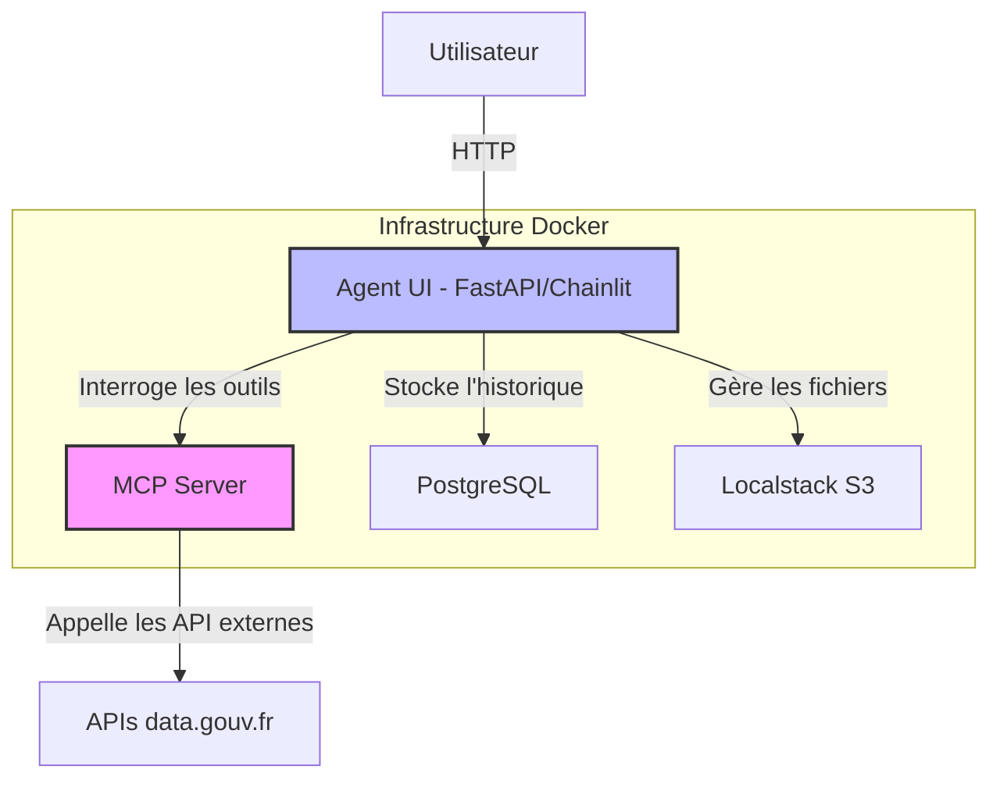

# France-GPT : Agents IA Spécialisés pour les Services Publics Français


[](https://github.com/votre-utilisateur/votre-repo/actions/workflows/ci-cd.yml)

**France-GPT** est une plateforme d'intelligence artificielle conversationnelle conçue pour interagir avec les données et services publics français. Le projet fournit une collection d'agents spécialisés qui exploitent les API officielles de `data.gouv.fr` (telles que Data Inclusion, Légifrance, La Bonne Alternance) en les transformant en outils actionnables pour des modèles de langage (LLMs) via le protocole **MCP (Model Context Protocol)**.

L'application est construite avec une architecture moderne incluant **FastAPI**, **Chainlit** pour l'interface de chat, et **Pydantic-AI** pour la logique des agents.


## ✨ Fonctionnalités Principales

-   🤖 **Agents Spécialisés** : Des profils d'agents distincts pour différents domaines (social, juridique, emploi) avec des instructions et des outils dédiés.
-   🔌 **Intégration d'API Publiques** : Transforme des API REST complexes en outils fiables et simples à utiliser pour les LLMs grâce à FastMCP.
-   💬 **Interface de Chat Moderne** : Une interface utilisateur réactive et complète construite avec Chainlit, supportant les uploads de fichiers, l'affichage des appels d'outils, et l'historique des conversations.
-   🐳 **Entièrement Conteneurisé** : Utilise Docker et Docker Compose pour une installation et un déploiement simplifiés, garantissant un environnement de développement et de production cohérent.
-   💾 **Persistance des Données** : Sauvegarde l'historique des conversations et les données des utilisateurs dans une base de données PostgreSQL.
-    S3 **Gestion des Fichiers** : Utilise une simulation S3 (via Localstack) pour gérer les uploads de fichiers, comme les CVs pour les candidatures.
-   🔄 **CI/CD Intégrée** : Un pipeline GitHub Actions pour l'intégration continue et le déploiement, incluant le linting, les tests, et la publication des images Docker.

## 🏛️ Agents Disponibles

Ce projet propose plusieurs agents, chacun expert dans son domaine :

-   ### 🧑‍🤝‍🧑 Agent Social
    Un assistant expert de l'inclusion sociale en France, capable de rechercher des structures d'aide, des services de proximité et des ressources pour les citoyens.

-   ### ⚖️ Agent Juridique
    Un assistant spécialisé dans la législation française. Il peut rechercher des textes de loi, des articles de code, et des décisions de justice via l'API Légifrance.

-   ### 👨‍🏫 Agent Alternance
    Un conseiller expert pour trouver des offres d'emploi et des formations en alternance en France. Il guide l'utilisateur dans sa recherche et peut même l'assister pour postuler.

## 🏗️ Architecture

Le projet est basé sur une architecture microservices orchestrée par Docker Compose :

1.  **Agent UI (FastAPI + Chainlit)** : Le point d'entrée pour l'utilisateur. Il gère l'interface de chat, la logique de l'agent Pydantic-AI, et communique avec les autres services.
2.  **MCP Server** : Un serveur FastMCP qui exécute plusieurs sous-serveurs. Chaque sous-serveur expose les outils d'une API spécifique (Data Inclusion, Légifrance, etc.) sur un port différent.
3.  **PostgreSQL** : La base de données qui stocke l'historique des conversations, les utilisateurs, et les feedbacks.
4.  **Localstack** : Un simulateur de services AWS qui fournit un bucket S3 local pour le stockage des fichiers uploadés (ex: CVs).



## 🚀 Démarrage Rapide

### Prérequis

-   [Docker](https://www.docker.com/get-started)
-   [Docker Compose](https://docs.docker.com/compose/install/)

### Installation

1.  **Clonez le dépôt :**
    ```bash
    git clone https://github.com/votre-utilisateur/france-gpt.git
    cd france-gpt
    ```

2.  **Configurez les variables d'environnement :**
    Copiez le fichier d'exemple et remplissez les clés d'API requises.
    ```bash
    cp .env.example .env
    ```
    Ouvrez le fichier `.env` et ajoutez vos clés pour :
    -   `DATAINCLUSION_API_KEY`
    -   `LEGIFRANCE_CLIENT_ID` & `LEGIFRANCE_CLIENT_SECRET`
    -   `LABONNEALTERNANCE_API_KEY`
    -   `OPENAI_API_KEY` (ou configurez `OPENAI_API_BASE_URL` pour un modèle local)

3.  **Lancez l'application avec Docker Compose :**
    Cette commande construira les images Docker et démarrera tous les services en arrière-plan.
    ```bash
    docker-compose up --build -d
    ```

4.  **Accédez à l'application :**
    Ouvrez votre navigateur et allez sur [http://localhost:8000](http://localhost:8000).

## 🛠️ Développement et Tests

### Installation des dépendances

Pour le développement local, il est recommandé d'utiliser un environnement virtuel et `uv`.

```bash
# Installer les dépendances de production et de développement
uv pip install -e .[dev]
```

### Linter et Formatter

Le projet utilise **Ruff** pour le linting et le formatage.

```bash
# Formater le code
ruff format .

# Vérifier les erreurs de linting
ruff check .
```

### Lancer les Tests

Les tests unitaires sont écrits avec **Pytest**.

```bash
pytest
```

## 📁 Structure du Projet

```
.
├── .github/workflows/      # Pipelines CI/CD pour GitHub Actions
├── .chainlit/              # Configuration de l'interface Chainlit
├── public/                 # Fichiers statiques (icônes, avatars, JS/CSS custom)
├── src/
│   ├── agent/              # Logique de l'agent IA (Pydantic-AI)
│   ├── app/                # Factory de l'application FastAPI
│   ├── core/               # Configuration centrale, logging, profils d'agents
│   ├── db/                 # Modèles de base de données (SQLAlchemy)
│   ├── mcp_server/         # Logique du serveur MCP (FastMCP)
│   │   └── services/       # Implémentation des outils pour chaque API
│   └── ui/                 # Code de l'interface Chainlit (on_message, etc.)
├── tests/                  # Tests unitaires pour chaque module
├── .dockerignore           # Fichiers à ignorer lors du build Docker
├── .gitignore              # Fichiers à ignorer par Git
├── docker-compose.yml      # Orchestration des services Docker
├── Dockerfile              # Définition de l'image Docker de l'application
├── main.py                 # Point d'entrée de l'application FastAPI/Chainlit
└── pyproject.toml          # Définition du projet et des dépendances
```

## 📜 Licence

Ce projet est distribué sous la licence MIT. Voir le fichier [LICENSE](LICENSE) pour plus de détails.