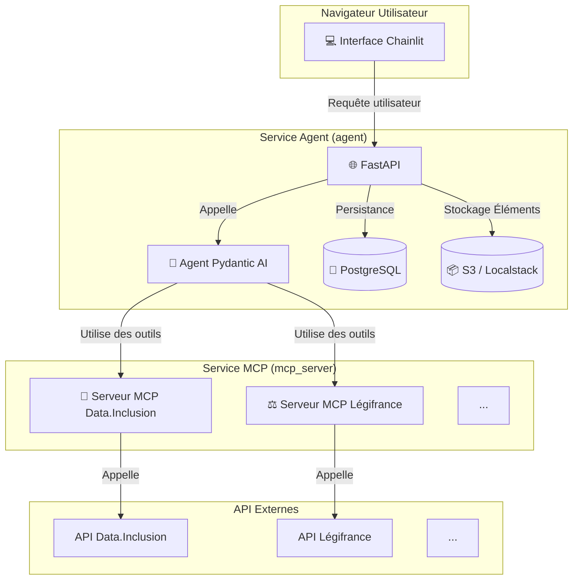

# FranceGPT 🇫🇷

<div align="center">
<a href="https://www.python.org" target="_blank" rel="noreferrer">

</a>
<a href="https://fastapi.tiangolo.com/" target="_blank" rel="noreferrer">

</a>
<a href="https://ai.pydantic.dev/" target="_blank" rel="noreferrer">

</a>
<a href="https://chainlit.io/" target="_blank" rel="noreferrer">

</a>
<a href="https://www.docker.com/" target="_blank" rel="noreferrer">

</a>
<a href="https://gofastmcp.com/getting-started/welcome" target="_blank" rel="noreferrer">

</a>
</div>
<br/>

FranceGPT est une application conversationnelle de type ChatGPT, conçue pour interagir avec les données publiques françaises. Elle héberge une collection d'**Agents IA spécialisés** qui exploitent les API de `data.gouv.fr` (Légifrance, Data.Inclusion, INSEE, etc.) en les transformant en outils puissants et fiables pour les modèles de langage (LLM).


*(Image d'illustration : L'interface Chainlit avec la sélection des profils d'agents spécialisés.)*

## 🎯 Le Besoin Fondamental

Les API gouvernementales, bien que riches en informations, ne sont pas directement utilisables par les agents IA. Leurs schémas complexes et leurs formats de données brutes constituent une barrière.

**FranceGPT est né d'un besoin fondamental :** il faut transformer l'accès à ces API en **outils MCP (Model Context Protocol)**. Le protocole MCP standardise la communication entre les LLM et les services externes, rendant les interactions plus fiables, sécurisées et compréhensibles pour l'IA.

Ce projet sert de pont, permettant aux agents IA de non seulement consommer les données publiques, mais aussi de les comprendre, de les croiser et de créer des workflows complexes pour automatiser des tâches et fournir des réponses précises et contextualisées.

## ✨ Fonctionnalités Clés

- **🤖 Collection d'Agents Spécialisés** : Des agents pré-configurés comme l'**Agent Social** (basé sur Data.Inclusion) et l'**Agent Juridique** (basé sur Légifrance), chacun avec son propre prompt système et ses outils dédiés.
- **🔌 Serveurs MCP Dynamiques** : Utilise **FastMCP** pour créer dynamiquement des serveurs MCP pour chaque API gouvernementale configurée, rendant le système extensible à de nouvelles sources de données.
- **🛠️ Transformation d'Outils Avancée** : Ne se contente pas de convertir les endpoints OpenAPI. Un `ToolTransformer` enrichit les outils générés avec des noms plus clairs, des descriptions améliorées et des schémas optimisés pour une meilleure compréhension par les LLM.
- **💬 Interface Moderne avec Streaming** : Une interface utilisateur épurée de type ChatGPT construite avec **Chainlit**, offrant une expérience de streaming fluide qui montre en temps réel les appels d'outils (`cl.Step`).
- **🧠 Agents Intelligents avec Pydantic AI** : Utilise **Pydantic AI** pour la création d'agents robustes, la gestion de l'historique des conversations et l'orchestration des appels d'outils.
- **📦 Architecture Modulaire et Conteneurisée** : Une séparation claire des services (UI, Serveurs MCP, Base de données) via Docker, assurant la scalabilité et la facilité de déploiement.
- **💾 Persistance des Données** : Sauvegarde des conversations, des utilisateurs et des éléments grâce à l'intégration de la couche de données de Chainlit avec une base de données PostgreSQL.

## 🏗️ Architecture du Projet

L'architecture de FranceGPT est conçue pour être modulaire et robuste, séparant clairement les responsabilités de chaque composant.


1.  **Interface Utilisateur (Chainlit)** : L'utilisateur interagit avec l'un des agents spécialisés.
2.  **Service Agent (FastAPI + Pydantic AI)** :
    - Reçoit la requête de l'utilisateur.
    - L'**Agent Pydantic AI** sélectionné traite la demande.
    - Si nécessaire, l'agent décide d'utiliser un ou plusieurs outils. Il communique avec le service MCP approprié.
3.  **Service MCP (FastMCP)** :
    - Le serveur MCP reçoit la demande d'appel d'outil.
    - Il traduit cet appel en une requête HTTP standard vers l'API gouvernementale externe (ex: Data.Inclusion).
    - Il reçoit la réponse de l'API, la formate et la renvoie à l'agent.
4.  **Agent & UI** : L'agent reçoit le résultat de l'outil, formule une réponse finale et la streame à l'utilisateur via l'interface Chainlit.

## 🛠️ Technologies Utilisées

| Technologie | Rôle |
| :--- | :--- |
| **Pydantic AI** | Création des agents IA, gestion des conversations et orchestration des outils. |
| **FastMCP** | Transformation des API REST en serveurs d'outils standardisés (MCP). |
| **Chainlit** | Fourniture de l'interface utilisateur conversationnelle "ChatGPT-like". |
| **FastAPI** | Serveur web principal pour héberger l'application Chainlit. |
| **Docker & Docker Compose**| Conteneurisation et orchestration de tous les services de l'application. |
| **PostgreSQL** | Base de données pour la persistance des conversations et des utilisateurs (via Chainlit). |
| **SQLAlchemy** | ORM pour interagir avec la base de données PostgreSQL. |
| **Localstack** | Simulation locale des services AWS (S3) pour le stockage des éléments Chainlit. |

## 🚀 Installation et Lancement

Le projet est entièrement conteneurisé avec Docker, ce qui simplifie grandement son installation.

### Prérequis

-   [Docker](https://www.docker.com/get-started)
-   [Docker Compose](https://docs.docker.com/compose/install/)

### Étapes

1.  **Cloner le dépôt :**
    ```bash
    git clone https://github.com/votre-user/france-gpt.git
    cd france-gpt
    ```

2.  **Configurer les variables d'environnement :**
    Copiez le fichier d'exemple et remplissez les clés d'API nécessaires.
    ```bash
    cp .env.example .env
    ```
    Ouvrez le fichier `.env` et ajoutez vos clés pour :
    - `DATAINCLUSION_API_KEY`
    - `LEGIFRANCE_OAUTH_CLIENT_ID`
    - `LEGIFRANCE_OAUTH_CLIENT_SECRET`
    - `OPENAI_API_KEY` (ou configurez `OPENAI_API_BASE_URL` si vous utilisez un service compatible comme Ollama)

3.  **Lancer l'application avec Docker Compose :**
    Cette commande va construire les images Docker et démarrer tous les services (serveurs MCP, agent, base de données).
    ```bash
    docker-compose up --build -d
    ```

4.  **Accéder à l'application :**
    -   **Interface FranceGPT (Chainlit)** : [http://localhost:8001](http://localhost:8001)
    -   Serveur MCP Data.Inclusion (pour test) : `http://localhost:8000/health`
    -   Serveur MCP Légifrance (pour test) : `http://localhost:8002/health`

    > ✨ Le premier démarrage peut prendre quelques minutes le temps de télécharger les images de base et d'installer les dépendances.

## 📂 Structure du Dépôt

```
france-gpt/
├── .dockerignore
├── .env.example
├── docker-compose.yml
├── Dockerfile
├── main.py                # Point d'entrée de l'application FastAPI/Chainlit
├── pyproject.toml         # Dépendances du projet
└── src/
    ├── agent/             # Logique des agents Pydantic AI
    │   ├── agent.py       # Factory de création des agents
    │   └── ui_tools.py    # Outils spécifiques à l'UI (ex: afficher un site web)
    ├── app/               # Configuration de l'application FastAPI
    │   └── factory.py     # Factory de création de l'app FastAPI
    ├── core/              # Configuration centrale, profils, etc.
    │   ├── config.py      # Gestion de la configuration (Pydantic Settings)
    │   ├── lifespan.py    # Logique de démarrage/arrêt de l'app
    │   └── profiles.py    # Définition des profils d'agents (Agent Social, etc.)
    ├── db/                # Configuration de la base de données SQLAlchemy
    │   ├── models.py      # Modèles de tables pour Chainlit
    │   └── session.py     # Initialisation de la base de données
    ├── mcp_server/        # Logique des serveurs FastMCP
    │   ├── server.py      # Point d'entrée des serveurs MCP
    │   ├── factory.py     # Factory pour construire les serveurs MCP
    │   ├── tool_transformer.py # Enrichissement des outils générés
    │   └── services/      # Configurations par service (OpenAPI, mappings...)
    └── ui/                # Code de l'interface Chainlit
        ├── chat.py        # Logique de l'interface (on_message, profils...)
        ├── data_layer.py  # Configuration de la persistance Chainlit
        └── streaming.py   # Gestion avancée du streaming des réponses
```

## 💡 Comment ça marche ?

### 1. Le Serveur MCP (`FastMCP`)

Le cœur de la transformation API-vers-outil. Le `mcp_server/server.py` lit la variable `MCP_SERVICES_CONFIG` du fichier `.env`. Pour chaque service défini (comme `datainclusion` ou `legifrance`), il utilise `MCPFactory` pour :
1.  Charger le fichier `openapi.json` du service.
2.  Créer un client HTTP authentifié (Bearer ou OAuth2).
3.  Initialiser un serveur `FastMCP` qui génère automatiquement des outils à partir des endpoints OpenAPI.
4.  Appliquer le **`ToolTransformer`** : cette étape cruciale utilise le fichier `mappings.json` pour renommer les outils (ex: `list_structures_..._get` devient `list_all_structures`), enrichir leurs descriptions et leurs paramètres pour les rendre plus intuitifs pour un LLM.

### 2. L'Agent IA (`Pydantic AI`)

Quand un utilisateur interagit, `ui/chat.py` sélectionne un profil d'agent défini dans `core/profiles.py`. La factory `agent/agent.py` crée alors une instance de `pydantic_ai.Agent` :
-   Le **modèle LLM** est configuré (ex: `gpt-4.1-mini`).
-   Le **prompt système** du profil est injecté pour donner à l'agent son rôle et ses instructions.
-   Le **toolset MCP** est connecté en pointant vers l'URL du serveur MCP correspondant (`http://mcp_server:8000/mcp/`).
-   Des **outils d'interface** (`ui_tools.py`) sont également ajoutés, permettant à l'agent d'agir sur l'UI (ex: afficher un site web dans la barre latérale).

### 3. L'Interface Utilisateur (`Chainlit`)

`Chainlit` gère tout le front-end.
-   **`@cl.set_chat_profiles`** affiche les différents agents disponibles au démarrage.
-   **`@cl.on_message`** intercepte le message de l'utilisateur.
-   La fonction `process_agent_modern_with_history` est appelée. Elle utilise la méthode `agent.iter()` de Pydantic AI, qui est la manière la plus moderne et robuste de gérer une conversation.
-   Elle parcourt le graphe d'exécution de l'agent nœud par nœud (`ModelRequestNode`, `CallToolsNode`, etc.), ce qui permet d'afficher en temps réel les appels d'outils dans des `cl.Step` et de streamer la réponse finale token par token.

## 🤝 Contribuer

Les contributions sont les bienvenues ! Que ce soit pour ajouter de nouveaux agents, intégrer de nouvelles API `data.gouv`, améliorer la documentation ou corriger des bugs, n'hésitez pas à ouvrir une Pull Request ou une Issue.

## 📜 Licence

Ce projet est distribué sous la licence MIT. Voir le fichier `LICENSE` pour plus de détails.
