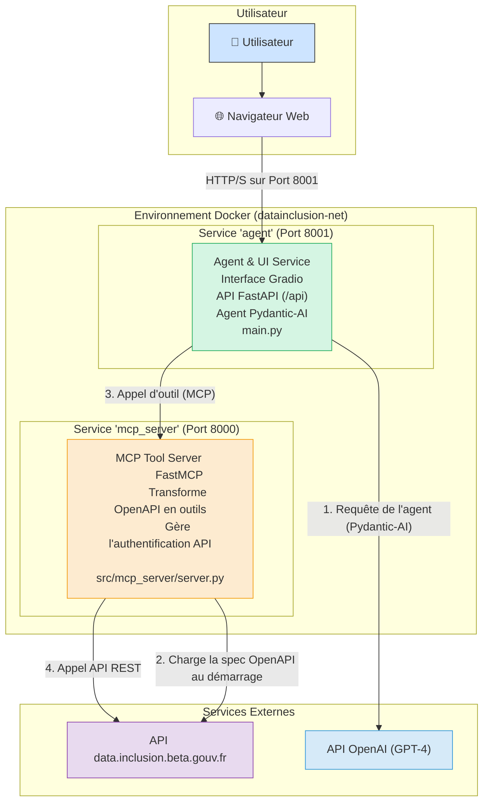

# Agent IA pour l'Inclusion Sociale

[](https://opensource.org/licenses/MIT)
[](https://www.python.org/downloads/release/python-3120/)
[](https://fastapi.tiangolo.com/)
[](https://www.docker.com/)

Cet agent conversationnel intelligent est conçu pour aider les utilisateurs à naviguer dans l'écosystème de l'inclusion sociale en France. Il se connecte à l'API [data.inclusion.beta.gouv.fr](https://data.inclusion.beta.gouv.fr/) pour fournir des informations précises et à jour sur les structures d'aide, les services disponibles et les ressources sur tout le territoire.

L'interface de chat offre une expérience utilisateur transparente, montrant en temps réel les outils que l'agent utilise pour trouver des réponses, ce qui permet de comprendre son "raisonnement".

### Aperçu de l'interface

*(Image d'exemple montrant le chat, les questions suggérées et la visualisation d'un appel d'outil)*

## ✨ Fonctionnalités Principales

* **🤖 Agent Expert :** Un assistant basé sur un LLM (GPT-4) spécialisé dans les questions d'inclusion sociale.
* **🔌 Conversion d'API en Outils :** Utilise **FastMCP** pour transformer dynamiquement la spécification OpenAPI de `data.inclusion` en outils utilisables par l'agent IA.
* **🔍 Transparence Totale :** L'interface **Gradio** affiche en temps réel les appels aux outils (`search_services`, `get_structure_details`, etc.), permettant de voir exactement comment l'agent obtient ses informations.
* **💬 Interface de Chat Moderne :** Une interface utilisateur réactive et conviviale construite avec Gradio 4.
* **🚀 Architecture Robuste :** Déploiement via **Docker Compose** avec deux services découplés :
    1. Un serveur MCP dédié à la gestion des outils.
    2. Un serveur pour l'agent IA et l'interface utilisateur.
* **⚙️ Configuration Centralisée :** Gestion simple des configurations via un fichier `.env` et Pydantic Settings.
* **✅ Prêt pour la Production :** Inclut des health-checks, une journalisation structurée et une configuration pour le déploiement.
* **📖 API Documentée :** L'agent expose sa propre API FastAPI avec une documentation Swagger UI (`/docs`).

## 🏗️ Architecture

Le projet est divisé en deux services Docker communiquant entre eux, assurant une séparation claire des responsabilités et une meilleure modularité.

1. **`mcp_server` (Serveur d'Outils)** :
    * Charge la spécification OpenAPI de `data.inclusion`.
    * La transforme en "outils" (fonctions) MCP (Model-Controlled Proxy).
    * Expose ces outils sur un port interne (`8000`) pour que l'agent puisse les consommer.
    * Gère l'authentification avec l'API `data.inclusion`.

2. **`agent` (Agent & Interface Utilisateur)** :
    * Contient l'agent IA (`pydantic-ai`) qui utilise le modèle GPT.
    * Se connecte au `mcp_server` pour découvrir et utiliser les outils disponibles.
    * Expose une interface de chat Gradio sur le port `8001`.
    * Fournit une API FastAPI pour une intégration programmatique.



## 🛠️ Technologies Utilisées

* **Backend & IA :** Python 3.12, FastAPI, Pydantic-AI, FastMCP
* **Frontend :** Gradio
* **Déploiement :** Docker, Docker Compose
* **Dépendances :** Uvicorn, HTTPX, python-dotenv

## 🚀 Démarrage Rapide

### Prérequis

* [Docker](https://www.docker.com/get-started)
* [Docker Compose](https://docs.docker.com/compose/install/) (généralement inclus avec Docker Desktop)

### Installation

1. **Clonez le dépôt :**

    ```bash
    git clone https://github.com/votre-user/datainclusion-mcp-server.git
    cd datainclusion-mcp-server
    ```

2. **Configurez les variables d'environnement :**
    Copiez le fichier d'exemple et modifiez-le pour y ajouter vos clés d'API.

    ```bash
    cp .env.example .env
    ```

    Ouvrez le fichier `.env` et remplissez les valeurs suivantes :

    ```ini
    # Clé API pour l'API data.inclusion (obligatoire)
    # Contactez l'équipe data.inclusion pour en obtenir une.
    DATA_INCLUSION_API_KEY=VOTRE_CLE_ICI

    # Clé API pour le modèle de langage (obligatoire)
    # Le projet est configuré pour OpenAI par défaut.
    OPENAI_API_KEY=sk-xxxxxxxxxxxxxxxxxxxxxxxxxxxxxx

    # (Optionnel) Clé pour sécuriser le serveur MCP.
    # Si non définie, le serveur MCP sera accessible sans authentification sur le réseau Docker.
    MCP_SERVER_SECRET_KEY=une-cle-secrete-aleatoire
    ```

### Initialisation de la base de données

Cette étape est nécessaire **une seule fois** après le premier lancement pour créer les tables de la base de données PostgreSQL requises par Chainlit.

1. **Lancez tous les services en arrière-plan :**
    ```bash
    # 1. Lancez tous les services en arrière-plan
    docker-compose up -d --build
    ```

2. **Créez les tables de la base de données :**
    ```bash
    # 2. Une fois les conteneurs démarrés, exécutez la commande de création de la base de données
    docker-compose exec agent chainlit create-db -y
    ```

3. **Vérifiez le bon fonctionnement :**
    ```bash
    # 3. Vous pouvez maintenant consulter les logs pour vérifier que tout fonctionne
    docker-compose logs -f
    ```

4. **Pour les lancements suivants :**
    Une fois l'initialisation terminée, vous pouvez utiliser la commande standard :

    ```bash
    docker-compose up --build
    ```

### Accès à l'application

* **Interface de Chat :** Ouvrez votre navigateur et allez à [**http://localhost:8001/chat**](http://localhost:8001/chat)
* **API de l'agent :** La documentation est disponible sur [http://localhost:8001/docs](http://localhost:8001/docs)
* **Health Check :** [http://localhost:8001/health](http://localhost:8001/health)

## 🔧 Configuration (Variables d'environnement)

Toutes les configurations sont gérées via le fichier `.env`.

| Variable                               | Description                                                                                             | Service Concerné |
| -------------------------------------- | ------------------------------------------------------------------------------------------------------- | ---------------- |
| `OPENAPI_URL`                          | URL de la spécification OpenAPI à utiliser pour générer les outils.                                     | `mcp_server`     |
| `DATA_INCLUSION_API_KEY`               | **(Requis)** Clé API pour s'authentifier auprès de l'API `data.inclusion`.                                  | `mcp_server`     |
| `MCP_SERVER_SECRET_KEY`                | Clé secrète pour signer les tokens d'accès au serveur MCP. Si vide, l'authentification est désactivée. | `mcp_server`     |
| `OPENAI_API_KEY`                       | **(Requis)** Votre clé API OpenAI pour le modèle de langage.                                              | `agent`          |
| `AGENT_MODEL_NAME`                     | Nom du modèle OpenAI à utiliser (ex: `gpt-4.1`, `gpt-4-turbo`).                                           | `agent`          |
| `AGENT_PORT`                           | Port sur lequel l'interface Gradio et l'API de l'agent seront exposées.                                   | `agent`          |
| `MCP_SERVER_URL`                       | URL interne pour que l'agent se connecte au serveur MCP. Ne pas modifier si vous utilisez Docker.       | `agent`          |
| `ENVIRONMENT`                          | Mode de l'application (`production` ou `development`).                                                  | `agent`          |

## 🧑‍💻 Développement Local (Sans Docker)

Si vous souhaitez exécuter les services localement pour le développement :

1. **Installez les dépendances :**

    ```bash
    pip install uv  # Installer le gestionnaire de paquets rapide
    uv pip install -r pyproject.toml
    ```

2. **Configurez votre fichier `.env`.**

3. **Lancez le serveur MCP :**
    Dans un premier terminal :

    ```bash
    python -m src.mcp_server.server
    ```

    Il tournera par défaut sur `http://localhost:8000`.

4. **Lancez l'agent et l'UI :**
    Dans un second terminal, assurez-vous que `MCP_SERVER_URL` dans votre `.env` pointe vers `http://localhost:8000/mcp` et que `AGENT_PORT` est différent (ex: `8001`).

    ```bash
    # Pour le mode développement avec rechargement automatique
    python main.py
    ```

## 📜 Licence

Ce projet est sous licence MIT. Voir le fichier [LICENSE](LICENSE) pour plus de détails.
